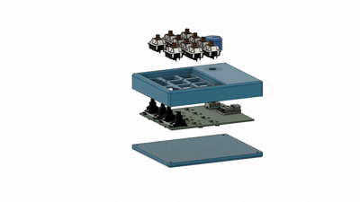

# KMK-Based Macropad (hxkeysair)

**A custom 10‑key macropad** built with a Seeed Studio XIAO RP2040 and KMK firmware. Electronics, PCB, and enclosure are designed in KiCad and 3D‑printed.

<p align="center">
  
</p>

## 📂 Project Files

```
KMK-Based-Macropad/
├── 3D_Model/    # 3D models (case, knob)
├── Firmware/    # KMK config & keymap
├── Media/       # GIF demo and images
├── PCB/         # Gerber and KiCad files
├── LICENSE      # License file
└── README.md    # This file
```

## 🔧 Build Guide

1. **3D Print**

   * Print `3D_Model/Main.stl`, `3D_Model/Plate.stl`, `3D_Model/Knob.stl`.

2. **Order PCB**

   * Upload `PCB/hxkeysair_gerber.zip` to your PCB.
   * Specs: 1.6 mm thickness, ENIG/HASL finish, M2 holes.

3. **Assemble**

   * Solder XIAO RP2040, diodes, and decoupling caps.
   * Install switches (8 × 1U, 2 × 2U with stabilizers).
   * Mount PCB with M2 screws into case.

4. **Flash Firmware**

   * Install KMK: `pip install kmk`
   * Edit `firmware/config.py` & `keymap.py` as needed.
   * Enter bootloader (hold BOOT on XIAO).


## 🚀 Usage

* The macropad runs KMK on power‑up.
* Use your layer key or encoder to switch layers.
* Modify and re‑flash to update layouts or macros.


## 📄 License

This project is released under the MIT License. See [LICENSE](LICENSE).

© 2025 Hsinwei Hsu
